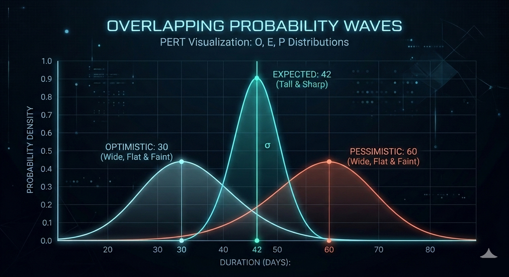

<div align="center">



# Progressive Estimation

**An AI skill for estimating AI-assisted and hybrid human+agent development work.**

Research-backed formulas. PERT statistics. Calibration feedback loops. Zero dependencies.

[](LICENSE)
[]()
[]()
[]()
[]()
[]()
[]()
[]()

</div>

---

> [!WARNING]
> **Early development.** Progressive Estimation is actively developed and the formulas, multipliers, and default values change frequently. Expect rough edges, incomplete calibration, and breaking changes between versions. Bug reports, calibration data, and PRs are welcome.

> [!NOTE]
> **Estimation is one of the hardest problems in software engineering.** A database migration might take 2 days for a small app or 2 years for a large enterprise system. Meanwhile, small tasks that once took hours can now be completed in minutes with modern AI tools. This skill gives you structure and consistency — not certainty. See [DISCLAIMER.md](DISCLAIMER.md) for the full picture.

---

## What It Does

- Estimates development tasks accounting for both **human and AI agent effort**
- Supports **single tasks or batches** (paste 5 issues or 500)
- Produces **PERT expected values** with confidence bands, not just ranges
- Separates **"expected"** from **"committed"** estimates at your chosen confidence level
- Estimates **token consumption and API cost** per model tier (economy/standard/premium)
- Outputs in formats ready for **Linear, JIRA, ClickUp, GitHub Issues, Monday, GitLab, Asana, Azure DevOps, Zenhub, and Shortcut**
- Includes a **calibration system** to improve accuracy over time with actuals

## Quick Start

### Install

**Claude Code** (recommended — full progressive loading):

```bash
git clone https://github.com/Enreign/progressive-estimation.git ~/.claude/skills/progressive-estimation
```

**Other clients:** See the full [Installation Guide](INSTALLATION.md) for setup instructions for **Cursor, GitHub Copilot, Windsurf, Cline, Aider, Continue.dev, ChatGPT, and Gemini Code Assist**.

### Use

In your AI coding client, just ask for an estimate:

```
Estimate: "Add Stripe payment integration to our checkout flow"
```

Or batch estimate:

```
Estimate these tasks:
1. Add dark mode toggle
2. Migrate database from MySQL to PostgreSQL
3. Build Slack notification service
4. Implement CSV export for reports
5. Set up end-to-end test suite
```

The skill auto-triggers on keywords like *estimate*, *how long*, *effort*, *sizing*, *story points*.

> [!TIP]
> Works with **any AI coding client** that supports custom instructions.
> Claude Code, Cursor, and GitHub Copilot get progressive loading (files
> load on demand). All others work with the full skill loaded at once.
> See [INSTALLATION.md](INSTALLATION.md) for your client.

---

## How It Works

### Progressive Disclosure

The skill asks only what it needs. Two paths, two scopes:

| Path | Questions | Best For |
|------|-----------|----------|
| **Quick** | 4 questions + defaults | Fast sizing, backlog grooming |
| **Detailed** | 13 questions, full control | Sprint commitments, external deadlines |

```
Quick + Single    fastest, ~4 questions
Quick + Batch     paste a list, get a table
Detailed + Single full intake, rich output
Detailed + Batch  shared defaults + per-task overrides
```

### Computation Pipeline

```
Agent Rounds x Minutes per Round
    + Integration Time
    + Human Fix Time (agent-effectiveness-adjusted)
    + Human Review Time
    + Human Planning Time
    x Org Size Overhead (human time only)
    x Task Type Multiplier
    -> Cone of Uncertainty spread
    -> PERT Expected + Standard Deviation
    -> Confidence Multiplier
    = Expected Estimate + Committed Estimate
```

### Key Concepts

<details>
<summary><strong>Agent Effectiveness Decay</strong></summary>

Based on [METR research](https://metr.org/blog/2025-07-10-early-2025-ai-experienced-os-dev-study/): AI agents handle ~90% of small tasks well but only ~30% of XL tasks. The skill automatically increases human effort for larger tasks.

| Size | Agent Effectiveness | Human Fix Adjustment |
|------|-------------------|---------------------|
| S | 90% | Minimal correction |
| M | 70% | Moderate intervention |
| L | 50% | Significant steering |
| XL | 30% | Human-driven with agent assist |

</details>

<details>
<summary><strong>PERT Three-Point Estimation</strong></summary>

Every estimate produces a weighted expected value using the PERT beta distribution:

```
Expected = (min + 4 x midpoint + max) / 6
SD = (max - min) / 6
```

This gives stakeholders a single "most likely" number plus confidence bands (68%, 95%).

</details>

<details>
<summary><strong>Confidence Levels</strong></summary>

Separate "what we expect" from "what we commit to":

| Level | Multiplier | Use Case |
|-------|-----------|----------|
| 50% | 1.0x | Stretch goal, internal planning |
| 80% | 1.4x | Likely delivery (default) |
| 90% | 1.8x | Safe commitment, external deadlines |

Based on [James Shore's risk management framework](http://www.jamesshore.com/v2/blog/2008/use-risk-management-to-make-solid-commitments).

</details>

<details>
<summary><strong>Cone of Uncertainty</strong></summary>

Early-phase estimates get wider ranges automatically:

| Phase | Spread | Accuracy |
|-------|--------|----------|
| Concept | 2.0x wider | Can be off by 2-4x |
| Requirements | 1.5x wider | Major decisions made |
| Design | 1.2x wider | Most unknowns resolved |
| Ready to build | Baseline | Clear spec |

Based on [Construx research](https://www.construx.com/books/the-cone-of-uncertainty/).

</details>

<details>
<summary><strong>Task Type Multipliers</strong></summary>

Different work has different lifecycle overhead:

| Type | Multiplier | Why |
|------|-----------|-----|
| Coding | 1.0x | Baseline |
| Bug fix | 1.2x | Debugging, reproduction, regression testing |
| Investigation | 0.5x | Timeboxed — output is a plan, not code |
| Design | 1.2x | Iteration with stakeholders |
| Testing | 1.3x | Environment setup, fixtures, flakiness |
| Infrastructure | 1.5x | Provisioning, CI/CD, deployment verification |
| Data migration | 2.0x | Planning, validation, rollback, staged rollout |

</details>

---

## Example Output

### Single Task (Quick Mode)

```
Expected: ~4 hrs | Committed (80%): ~5.5 hrs | 10-26 agent rounds + 3 hrs human | Risk: medium | Size: M

PERT Expected: 4.2 hrs (most likely outcome)
Standard Deviation: +/-0.8 hrs
68% Confidence: 3.4 - 5.0 hrs
95% Confidence: 2.6 - 5.8 hrs
```

| Field | Value |
|-------|-------|
| Complexity | M |
| Task Type | coding |
| Agent Rounds | 10-26 |
| Agent Time | 20-78 min |
| Human Review | 60 min |
| Human Planning | 30-60 min |
| Human Fix/QA | 8-30 min |
| **Expected (PERT)** | **~4 hrs** |
| **Committed (80%)** | **~5.5 hrs** |
| Risk | medium |
| Team | 1 human, 1 agent |

### Batch (Quick Mode)

```
5 tasks | Expected: ~23.5 hrs | Committed (80%): ~32.8 hrs | 2S, 2M, 1L
```

| # | Task | Size | Type | Expected | Committed | Risk |
|---|------|------|------|----------|-----------|------|
| 1 | Dark mode toggle | S | coding | ~1.3 hrs | ~1.8 hrs | low |
| 2 | DB migration | L | data-mig | ~14.2 hrs | ~19.8 hrs | high |
| 3 | Slack notifier | M | coding | ~2.9 hrs | ~4.1 hrs | med |
| 4 | CSV export | S | coding | ~1.3 hrs | ~1.8 hrs | low |
| 5 | E2E test suite | M | testing | ~3.8 hrs | ~5.3 hrs | med |

> **Warning:** Task #2 is type=data-migration (2.0x overhead). Consider phased delivery.

---

## Issue Tracker Integration

Estimates can be output in two modes for any supported tracker:

| Mode | How It Works | Setup |
|------|-------------|-------|
| **Embedded** (default) | Markdown table in description/body | None |
| **Native** | Maps to tracker-specific fields | Custom fields |

**Supported:** Linear, JIRA, ClickUp, GitHub Issues, Monday, GitLab, Asana, Azure DevOps, Zenhub, Shortcut

Embedded mode works everywhere immediately. Native mode requires custom fields for agent-specific metrics.

---

## Standalone Calculator

Don't want to depend on an LLM for arithmetic? Ask the skill to generate a deterministic calculator:

```
Generate an estimation calculator in Python
```

Generates a single-file, zero-dependency script from the canonical formulas. Accepts inputs via CLI args or stdin JSON, outputs the full estimate as JSON.

**Supported languages:** Python, TypeScript, JavaScript, Rust, Go, Ruby, Java, C#, Swift, Kotlin

---

## Calibration

Estimates improve with feedback. The skill includes a calibration system:

| Step | What |
|------|------|
| 1. **Log actuals** | Record estimated vs. actual effort after completing work |
| 2. **Track PRED(25)** | Percentage of estimates within 25% of actual (target: 75%) |
| 3. **Reference stories** | Maintain examples per size per task type as anchors |
| 4. **Bias detection** | Identify systematic over/under estimation |
| 5. **Team profiles** | Separate calibration per team |

Most teams reach PRED(25) >= 65% within 3-5 calibration cycles and >= 75% within 8-12 cycles.

See [references/calibration.md](references/calibration.md) for the full system.

---

## File Structure

```
progressive-estimation/
├── SKILL.md                    Workflow map (loaded first, always)
├── INSTALLATION.md             Setup guide for 9 AI coding clients
├── DISCLAIMER.md               Honest limitations of estimation
├── CONTRIBUTING.md             How to contribute
├── CODE_OF_CONDUCT.md          Community guidelines
├── README.md
├── LICENSE                     MIT
├── .github/
│   ├── PULL_REQUEST_TEMPLATE.md
│   └── ISSUE_TEMPLATE/
│       ├── bug_report.md
│       ├── feature_request.md
│       └── calibration_data.md
├── references/
│   ├── questionnaire.md        Progressive intake (phase 1)
│   ├── frameworks.md           Round-based, module/wave, S-M-L (phase 2)
│   ├── formulas.md             All arithmetic, single source of truth (phase 3)
│   ├── output-schema.md        Output formats, tracker mappings (phase 4)
│   └── calibration.md          Tuning with actuals (phase 5, on request)
└── evals/
    ├── eval-quick.md           Quick path smoke test
    ├── eval-hybrid.md          Detailed path, multi-team
    ├── eval-batch.md           Batch with dependencies
    └── eval-regression.md      Known-good baselines
```

Files are loaded progressively — the skill only reads what it needs for the current phase. `SKILL.md` is the map; reference files are the territory.

---

## Research

The estimation model is informed by:

| Source | Contribution |
|--------|-------------|
| [METR](https://metr.org/blog/2025-07-10-early-2025-ai-experienced-os-dev-study/) | Agent effectiveness decay by task size; AI time horizon benchmarks |
| [PERT](https://en.wikipedia.org/wiki/Three-point_estimation) | Three-point estimation with beta distribution |
| [James Shore](http://www.jamesshore.com/v2/blog/2008/use-risk-management-to-make-solid-commitments) | Risk multipliers for confidence-based commitments |
| [Jorgensen & Grimstad](https://www.sciencedirect.com/science/article/abs/pii/S0164121202001565) | Calibration feedback improving accuracy 64% -> 81% |
| [Construx](https://www.construx.com/books/the-cone-of-uncertainty/) | Cone of Uncertainty — estimate ranges narrowing as decisions are made |
| [Standish CHAOS](https://www.umsl.edu/~sauterv/7892/Standish/standish-IST.pdf) | Project overrun patterns and their limitations |

---

## Evals

Evaluation prompts per the [Claude Skills 2.0](https://claude.com/blog/improving-skill-creator-test-measure-and-refine-agent-skills) framework:

| Eval | Tests |
|------|-------|
| `eval-quick.md` | Quick path produces valid PERT output with minimal input |
| `eval-hybrid.md` | Detailed path handles multi-team, confidence levels, org overhead |
| `eval-batch.md` | Batch mode with mixed types, dependencies, and rollup |
| `eval-regression.md` | 8 baseline cases to detect drift after formula changes |

Run evals after any change to formulas, frameworks, or the skill workflow.

---

## Contributing

Contributions welcome — see [CONTRIBUTING.md](CONTRIBUTING.md) for guidelines. Key areas:

- **Calibration data** — Share anonymized estimated vs. actual results to improve default ratios
- **Tracker mappings** — Additional tracker support (Notion, Basecamp, etc.)
- **Task types** — New multipliers for work categories not yet covered
- **Formulas** — Improvements backed by data or research
- **Evals** — Additional test cases, especially edge cases

Please include research citations or empirical data when proposing formula changes.

This project follows a [Code of Conduct](CODE_OF_CONDUCT.md).

---

## License

[MIT](LICENSE) — Copyright (c) 2026 Stanislav Shymanskyi
